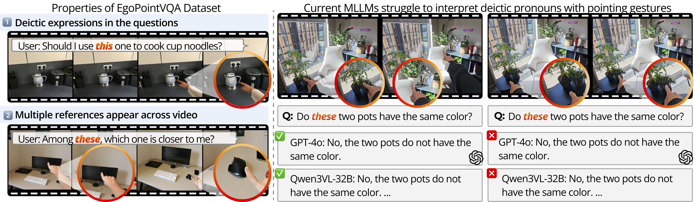

# Do You See What I Am Pointing At? <br> Gesture-Based Egocentric Video Question Answering

<div align="center">

[Yura Choi](https://yuuraa.github.io/)<sup>1</sup>, [Roy Miles](https://roymiles.github.io/)<sup>2</sup>, [Rolandos Alexandros Potamias](https://rolpotamias.github.io/)<sup>1</sup>, [Ismail Elezi](https://therevanchist.github.io/)<sup>2</sup>, [Jiankang Deng](https://jiankangdeng.github.io/)<sup>1</sup>, [Stefanos Zafeiriou](https://wp.doc.ic.ac.uk/szafeiri/)<sup>1</sup>

<sup>1</sup>Imperial College London &nbsp;&nbsp; <sup>2</sup>Huawei Noah's Ark Lab, UK

[]()
[](https://yuuraa.github.io/papers/choi2026egovqa/)
[]()
[]()

</div>

---

## 📌 Overview

> **TL;DR:** We introduce **EGOPOINTVQA**, the first benchmark for gesture-grounded egocentric video QA, and **HINT** (Hand Intent Tokens), which encodes 3D hand keypoints as tokens to help MLLMs understand pointing gestures.

Understanding and answering questions based on a user's pointing gesture is essential for next-generation egocentric AI assistants. However, current Multimodal Large Language Models (MLLMs) struggle with such tasks due to:
- Lack of gesture-rich training data
- No architectural support for reasoning about hand pose and pointing direction

<p align="center">
  
</p>


## 📢 Updates
- [x] Release the paper on arXiv
- [ ] Release EgoPointVQA dataset
- [ ] Release HINT checkpoint
- [ ] Release evaluation code
- [ ] Release training code


## 📖 Citation

```bibtex
@inproceedings{choi2026egopointvqa,
  title     = {Do You See What I Am Pointing At? Gesture-Based Egocentric Video Question Answering},
  author    = {Choi, Yura and Miles, Roy and Potamias, Rolandos Alexandros and Elezi, Ismail and Deng, Jiankang and Zafeiriou, Stefanos},
  booktitle = {CVPR},
  year      = {2026}
}
```

---

## Acknowledgement
Thanks to the open source of the following projects:
- Synthetic data generated using [AI2-THOR](https://ai2thor.allenai.org/) and [MIXAMO](https://www.mixamo.com/).
- 3D hand reconstruction powered by [WiLoR](https://github.com/rolpotamias/WiLoR).
- This work is built upon excellent previous research, including [InternVL3](https://github.com/OpenGVLab/InternVL),  [LLaVA-OneVision](https://github.com/LLaVA-VL/LLaVA-ViT), and [Qwen2.5-VL](https://github.com/QwenLM/Qwen3-VL).